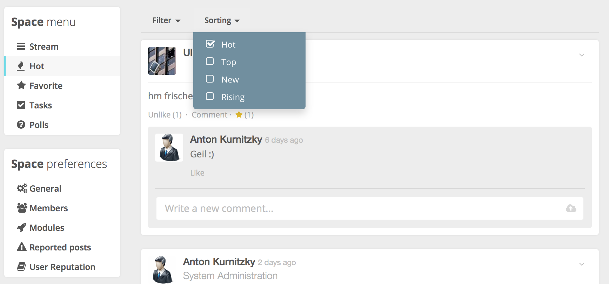
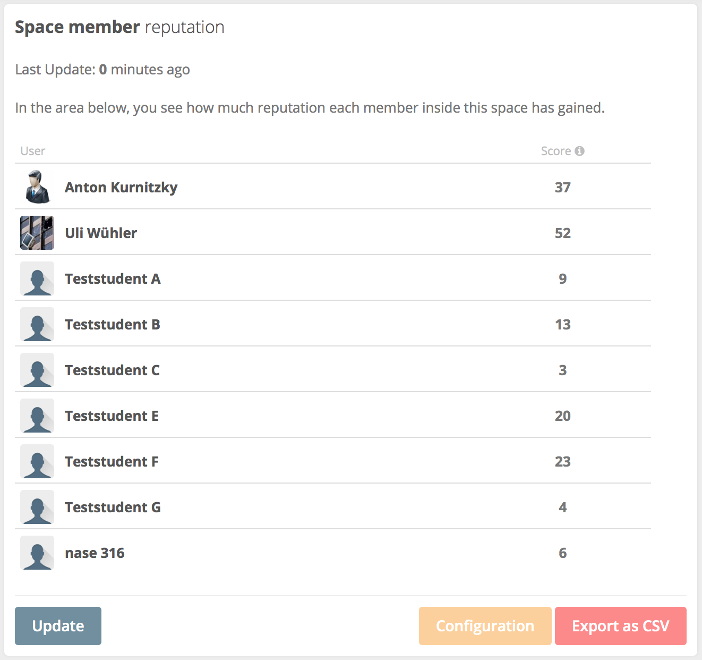
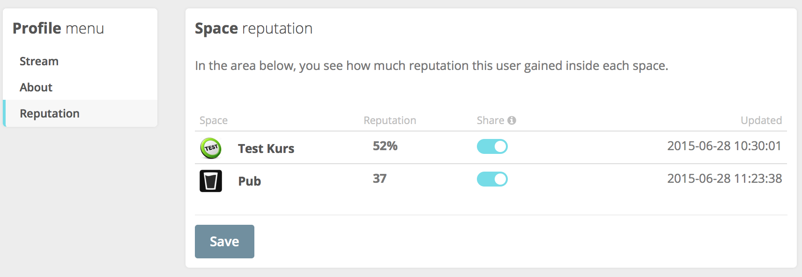
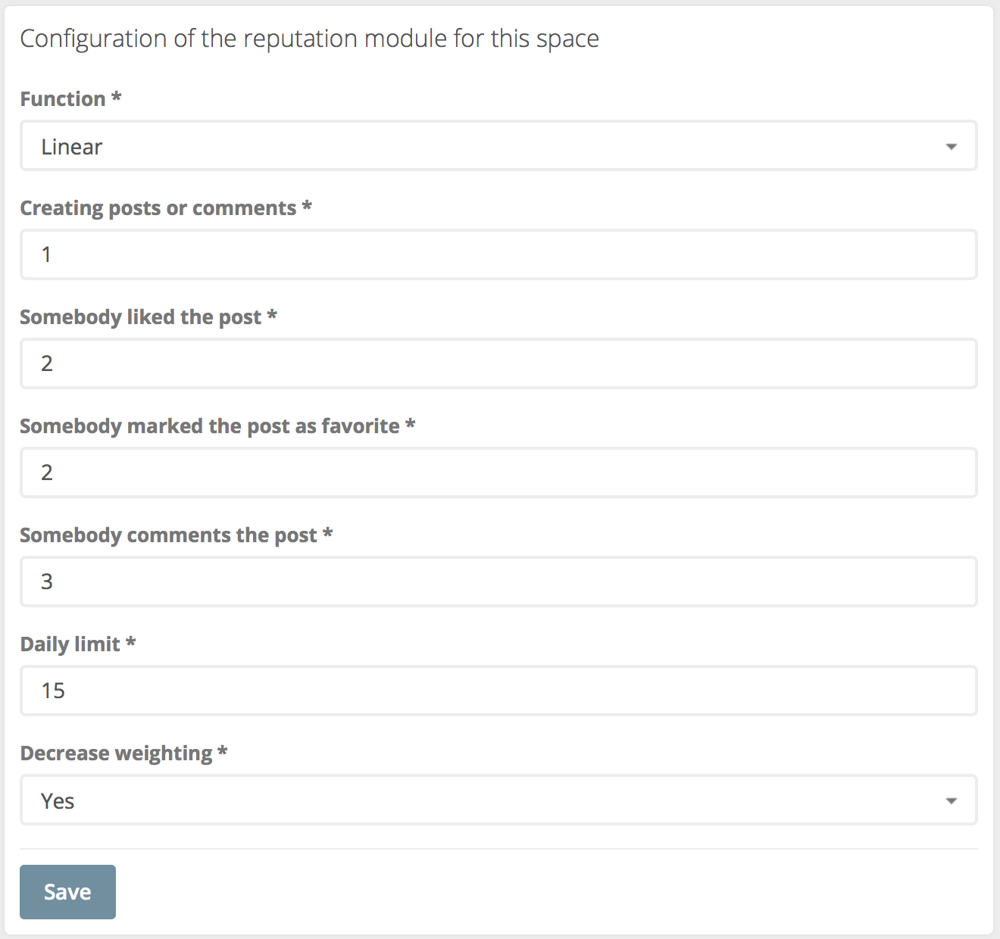

#Reputation module for HumHub
This module integrates a reputation system into HumHub.

##About
__Author:__ Anton Kurnitzky

This module was developed as part of my master thesis at the [Technische Hochschule Nürnberg](http://www.th-nuernberg.eu).
It's default settings are designed to work for a social network in an educational context. By customizing the settings you can probably use this in any other context too.
##Installation
* Copy the module to your HumHub module folder (.../humhub/protected/modules/reputation)
* The folder name must be "reputation"
* Activate the module on the HumHub admin page. Set it as default for space to activate it in all spaces. You should set is as default for user profiles so users can see their own reputation.
* If not set to default for spaces, activate the module on each space you want to get an entry in the space navigation menu
* If not set to default for user profiles, a user has to manually activate this module on their profile page.
* Install my favorite-module if you want more reputation-sources.

##Usage
### Everybody
Inside the space menu you will see a new menu called "Hot". This menu provides four new sorting options that are possible trough the reputation system. The ranking of the posts depends on the sorting option and your module configuration.

* Hot: The default sorting option. This option prioritizes posts that are younger than on week and have a high number of likes, favorites and comments.
* Top: This option shows you the best rated posts at the top. 
* New: Show posts created in the last 36 hours. Sorted by best rating.
* Rising: Similar to hot. But it prioritizes posts that are younger than 24 hours.

### Space-Admins
As Space-Admin you will get a new menu item called "User Reputation". Inside this menu you will see a list of all space members and their respective reputation score.

At the bottom you have three actions:

* Update: Refresh the data
* Configuration: Opens the module configuration for this space. [More info](#Configuration).
* Export as CSV: Export data to a CSV file. Useful to import this data to other systems. [More info](#CSV Export)

### Users
Inside your Profile menu you will see a new menu "Reputation". 

Here you see all the spaces you're a member of and that have the reputation module enabled.
You can see your reputation score and the time this score was last updated.
To share your reputation with other users you can enable this per space. If you enable this every other user inside the HumHub installation can see your reputation. This is an explicit opt-in option. To set this to enabled for all users you have to set the visible column in the table reputation_user to 1.

##Configuration

* Function: Use a linear function that just show the score the user reached or use a logarithmic function. The logarithmic function is a good motivator because you reach a high score with little effort. For pure comparision the linear setting should be fine. **Default** is Logarithmic.
* Base: This is only visible if you use the logarithmic function. Set the base for the logarithmic function. When you set it to 1000 a user needs 1000 points to get a value of 100%. But he only needs 32 points to get above 50%. **Default** is 100.
* Creating posts or comments: How much points should a user get for creating a post or comment. **Default** is 1.
* Somebody liked the post: How much points should the post creator get when somebody likes the post.  The user who clicks like doesn't get any points. **Default** is 2.
* Somebody marked the post as favorite: Same as "Somebody liked the post". **Default** is 2.
* Somebody comments the post: How much points should the creator of the original post get if somebody (other) posts a comment. The posts of the comment also gets points according to the setting "Creating posts or comments". **Default** is 3.
* Daily limit: Set a limit of points a user can reach on a single day. Set this to zero if you don't want to use a daily limit. **Default** is 15.
* Decrease weighting: This setting decreases the weighting of additional likes, comments, favorites on a post. It divides any additional like by the count of likes. So for example 2 likes with the "Somebody liked the post" setting set to 2 generates only 3 points for the post creator. 2 + 2/2. 5 likes is 2 + 2/2 + 2/3 + 2/4 + 2/5 = 4.56.  The exact formula is:  The purpose of this setting is to make it really hard to get a high reputation score from just one post. **Default** is Yes.

##CSV Export
If you use linear as function you just get a csv containing the e-mail addresses of your space members and their reputation score.
If you use logarithmic you will see an additional dialog.

Here you can set a weighting that will be multiplied with the percentage score. If you just want to export the percentage value use 1 as weighting.
Percentage values that are above 100% will be used as 100%.

##Technical
### Update interval
This module uses the [hourly cron job of HumHub](https://github.com/humhub/humhub/blob/master/protected/docs/guide/administration/installation.md#enable-cron-jobs). So make sure you properly configured the cron job on your system. If you want more up to date data you should change the cron schedule.
 
It also uses [Yii Caching](http://www.yiiframework.com/doc/guide/1.1/en/caching.overview) to improve loading times. The cache is set to 15minutes. So if you open a view (e.g. "User Reptuation") it will use cached data if it's newer than 15 minutes. Otherwise it will refresh the data before displaying the view.
If you want to see more up to date data you can always click on the "Update" button.

That means you should never see data that's older than 15 minutes.

### Reputation sources
Posts, Likes, Favorites and comments are used as reputation sources. Therefore this module uses the associated database tables (content, post, like, comment, favorite, etc.).

### Calculation
The reputation calculation is performed dynamically. This means that on every calculation everything will be reconsidered.
That gives you the advantage that you can change the module settings any time and the recalculated values will take the new settings into account. So you could just test a bunch of different settings and see their outcome.
